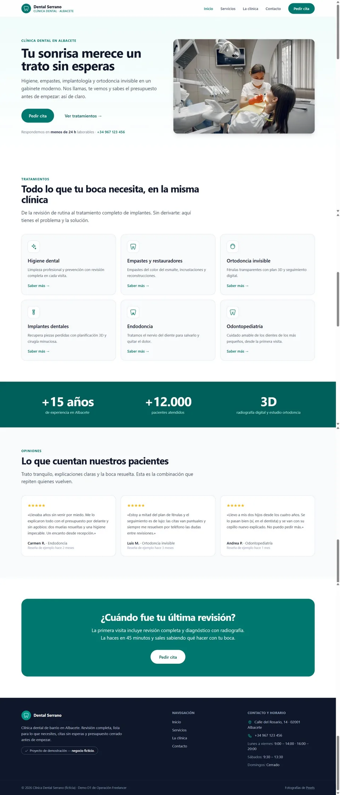

# Clínica Dental Serrano — web de demostración (demo D1)

> **⚠️ Negocio 100% FICTICIO.** "Clínica Dental Serrano" es una empresa inventada, creada
> como demostración de portafolio (*demo D1* de **Operación Freelancer**, servicio S1:
> *"así entregamos una web de negocio"*). Ni la clínica, ni el equipo, ni la dirección,
> teléfono u opiniones que se mencionan existen. Las fotografías son de banco de imágenes
> de uso libre ([Pexels](https://www.pexels.com/license/)) y representan personas reales
> distintas de los personajes ficticios nombrados.



## Qué incluye esta demo

Web estática de **4 páginas** en español, con copy realista (cero lorem ipsum):

| Página | Contenido |
| --- | --- |
| [Inicio](https://d1-clinica-serrano.netlify.app) | Hero con CTA "Pedir cita" · 6 servicios con iconos · franja de confianza · 3 opiniones · CTA final |
| [Servicios](https://d1-clinica-serrano.netlify.app/servicios/) | Higiene · Empastes y restauradores · Ortodoncia invisible · Implantes · Endodoncia · Odontopediatría |
| [La clínica](https://d1-clinica-serrano.netlify.app/la-clinica/) | Equipo (2 dentistas + auxiliar) · 6 fotos · "cómo trabajamos" |
| [Contacto](https://d1-clinica-serrano.netlify.app/contacto/) | Formulario (Netlify Forms) · dirección y horario · mapa OpenStreetMap (sin API keys) |

**Entregas "de serie" (la diferencia del servicio S1):**

- Metas `title`/`description` únicos por página, Open Graph, canónicas y `sitemap.xml` + `robots.txt`.
- **JSON-LD `Dentist`** (nombre, dirección, geo, horario) en las 4 páginas.
- **Cabeceras de seguridad** vía `_headers` de Netlify: `X-Frame-Options: DENY`,
  `X-Content-Type-Options: nosniff`, `Referrer-Policy: strict-origin-when-cross-origin`.
  (HTTPS forzado lo aplica Netlify por defecto en todos sus sitios.)
- Imágenes optimizadas a **WebP por Astro** con **lazy loading** (el héroe, ~172 kB → 33 kB).
- Accesibilidad básica: contraste, `label` en el formulario, `alt` descriptivos,
  enlace "saltar al contenido", menú con `aria-expanded`.
- Sin CSS/JS de terceros: Tailwind por utilidades y un script de 8 líneas para el menú móvil.
- Formulario listo para **Netlify Forms** (campo `form-name`, `data-netlify` y honeypot antispam).
- **Dependencias fijadas por versión exacta** (`package.json` sin `^`/`~`; el árbol completo con sus hashes queda fijado en `package-lock.json`).
- **Cero recursos de terceros**: el único JS es el propio de la web (menú móvil) y el único CSS es el bundle de Tailwind compilado — nada de Google Fonts, analytics ni CDNs. El mapa es un `iframe` de OpenStreetMap, sin API keys.
- **QA de seguridad automático tras cada build** (`postbuild` → `scripts/qa-seguro.mjs`): el build **falla** si en `dist/` entra un `.env`/keystore/sourcemap, un secreto del cliente incrustado o un script/CSS servido desde fuera del dominio. A `dist/` es lo único que se despliega (Netlify Drop).

## Stack

- [Astro](https://astro.build) (estático) + [Tailwind CSS](https://tailwindcss.com) v4 vía `@tailwindcss/vite`.
- Sin CMS ni backend. Despliegue en Netlify (plan gratis).
- Fuente system-ui (cero peticiones externas de tipografía).

## Cómo correrlo

```bash
npm install
npm run dev        # http://localhost:4321
npm run build      # genera dist/
npm run preview    # sirve dist/ en local
```

## Estructura

```
src/
├── assets/              # fotos (banco libre); Astro las optimiza a WebP al compilar
├── components/          # Header, Footer, Icono
├── data/site.ts         # ← nombre, URL, dirección, teléfono y horario del "cliente"
├── data/services.ts     # ← tratamientos
├── layouts/BaseLayout.astro   # metas SEO/OG, JSON-LD, menú móvil
└── pages/               # index · servicios · la-clinica · contacto (+ robots.txt, sitemap.xml)
public/
├── _headers             # cabeceras de seguridad de Netlify
├── favicon.svg
└── images/og-clinica-serrano.jpg
docs/capturas/           # capturas desktop/móvil de las 4 páginas
scripts/qa-seguro.mjs    # guard de seguridad que corre tras cada build
```

Todo lo que cambia de un cliente a otro vive en `src/data/site.ts` y `src/data/services.ts`.
Guía para el cliente: **[GUÍA.md](GUÍA.md)**.

## Estado

Demo terminada y en producción en Netlify (ver enlace arriba). El formulario entrega en el
panel de Netlify Forms (modo demo). Alcance congelado según ficha: fuera de alcance —
reserva online con calendario, panel de administración, blog/CMS, multiidioma, SEO avanzado
o Google Business Profile.